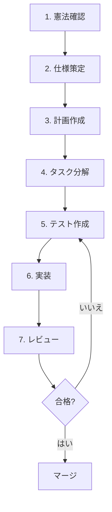
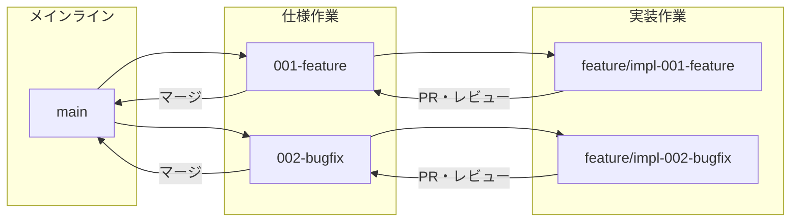
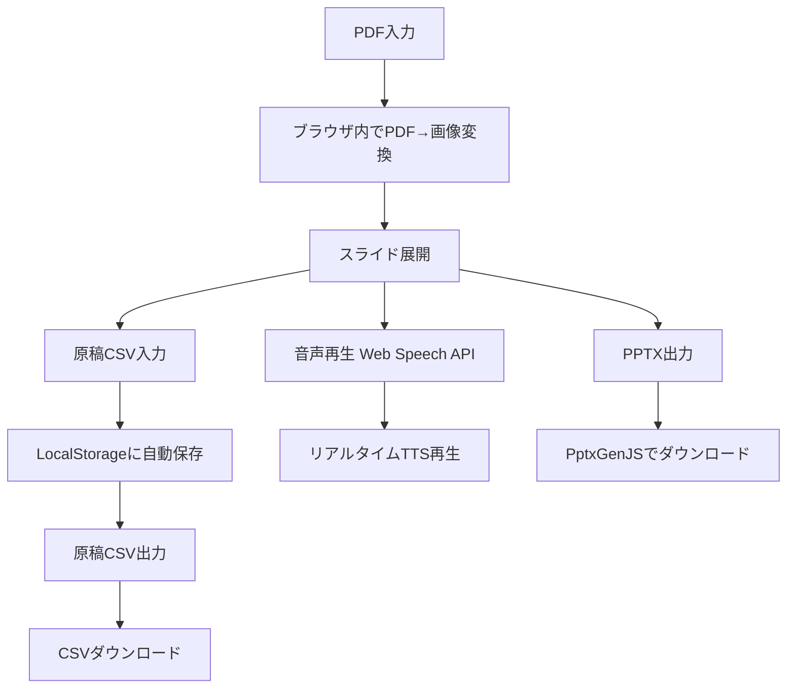

# Slide Voice Maker 憲法

**バージョン**: 1.0.0  
**日付**: 2026-1-5  
**リポジトリ**: https://github.com/J1921604/Slide-Voice-Maker_standalone

## コア原則

### I. テスト駆動開発（必須）

テスト駆動開発（TDD）を徹底し、仕様に対する検証を必須とする。

**ルール**:

- テスト作成 → テスト失敗確認 → 実装 → テスト成功確認 のサイクルを厳守する
- Red-Green-Refactor サイクルに従う
- 仕様変更時は必ずテストを先に更新する
- 統合テスト: ライブラリ契約、サービス間通信、共有スキーマに対して実施する

**根拠**: テストファーストにより、仕様と実装の乖離を防ぎ、リファクタリング時の安全性を確保する。

### II. セキュリティ最優先

セキュリティ要件を機能要件より優先する。

**ルール**:

- 機密データの平文保存を禁止し、暗号化またはハッシュ化を必須とする
- 認証・認可処理は標準ライブラリまたは実績あるフレームワークを使用する
- 外部入力は必ずバリデーションとサニタイズを行う
- セキュリティイベントはすべてログに記録する

**根拠**: セキュリティ脆弱性は後から修正するコストが高く、ユーザーの信頼を損なう。

### III. パフォーマンス基準

パフォーマンス閾値を定量化し、受入基準に組み込む。

**ルール**:

- メモリ使用量: 処理対象PDFサイズの5倍以内に抑える
- 出力ファイルサイズ: 元PDF+音声の2倍以内を目安とする
- パフォーマンス劣化は受入基準で検出する

**根拠**: 定量的な基準により、パフォーマンス問題を早期発見し、ユーザー体験を維持する。

### IV. 品質と一貫性

コード品質とユーザー体験の一貫性を維持する。

**ルール**:

- 文字エンコーディングは UTF-8 を標準とし、文字化け対策を徹底する
- 外部依存はバージョン固定（requirements.txt）により再現性を確保する
- エラーメッセージは日本語で明確に、解決策を示す
- ドキュメントから英語テンプレート部分を確実に削除する

**根拠**: 一貫した品質基準により、保守性と信頼性を確保する。

### V. シンプルさの追求

シンプルな設計を優先し、複雑さを正当化する。

**ルール**:

- YAGNI（You Aren't Gonna Need It）原則に従う
- 複雑なパターンの導入には明確な理由を文書化する
- 既存コードの重複削除より、明確性を優先する

**根拠**: シンプルな設計は理解しやすく、バグが少なく、保守が容易である。

## 制約事項

### セキュリティ制約

- 機密データの平文保存を禁止（暗号化・ハッシュ化必須）
- APIキー・認証情報はコードに埋め込まず環境変数を使用する
- 外部通信はHTTPSを必須とする

### 依存関係制約

- 外部依存はCDN経由で提供し再現性を確保する
- ブラウザ環境で動作するライブラリを使用する
- 新規依存追加時は互換性を確認する

### 品質制約

- 仕様と実装の乖離をレビューで検知・是正する
- すべてのファイルは UTF-8 エンコーディングで保存する
- ログ出力は構造化し、デバッグ可能性を確保する

## 開発ワークフロー

### 作業順序

以下の順序で作業を進める（遵守必須）:



### 検証サイクル

- 正常に動作するまで繰り返し検証しエラー修正を完了する
- 簡略化による品質低下は許容しない

### レビュー要件

- 重大変更にはレビュー承認を必須とする
- 憲法違反の検出時は修正を優先する
- セキュリティ関連の変更は追加レビューを行う

## ブランチ戦略

仕様と実装はブランチ（spec/impl）で分離する。

### 仕様ブランチ（mainブランチから派生）

```bash
git checkout main
git checkout -b <番号>-<短い名前>
# 例: git checkout -b 001-video-export
```

### 実装ブランチ（仕様ブランチから派生）

```bash
git checkout 001-<topic>
git checkout -b feature/impl-<番号>-<短い名前>
# 例: git checkout -b feature/impl-001-video-export
```

### ブランチフロー



## Mermaid図ガイドライン

ドキュメントにはMermaid v11準拠の図を挿入する。

### 推奨構文

| 用途           | 推奨構文                |
| -------------- | ----------------------- |
| ブランチ戦略   | flowchart TB + subgraph |
| プロセスフロー | flowchart TD/LR         |
| 時系列         | sequenceDiagram         |
| 状態遷移       | stateDiagram-v2         |

### 日本語対応

- flowchart、graph、sequenceDiagram は日本語完全対応
- ノードラベル、エッジラベル、Note で日本語使用可能
- gitGraph 構文は日本語コミットメッセージに対応していないため避ける

### 禁止事項

- gitGraph での日本語使用（代わりに flowchart/graph 形式を使用）
- tag: 構文（非推奨、ノードで表現する）
- `${{}}` などの特殊文字をノードラベルに使用

## ガバナンス

### 憲法の優先順位

本憲法はすべての開発慣行に優先する。憲法に違反するコードはマージを禁止する。

### 改訂手続き

1. 改訂提案を文書化する
2. レビュー承認を取得する
3. 移行計画を策定する（既存コードへの影響がある場合）
4. バージョンを更新する

### バージョニング規則

セマンティックバージョニングに従う:

- **MAJOR**: 後方互換性のない原則の削除・再定義
- **MINOR**: 新規原則・セクションの追加、大幅なガイダンス拡張
- **PATCH**: 明確化、文言修正、誤字脱字修正

### コンプライアンス検証

- すべてのPR/レビューで憲法遵守を確認する
- 複雑さの導入は正当化を文書化する
- 開発ガイダンスは `.specify/templates/` を参照する

## プロダクト機能仕様

### スタンドアロン版機能一覧



**Version**: 1.0.0 | **Ratified**: 2026-1-5 | **Last Amended**: 2026-1-5
