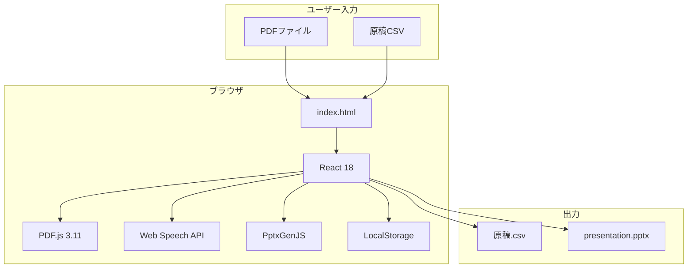

# Slide Voice Maker（スタンドアロン版）

**バージョン**: 1.0.0  
**日付**: 2026-1-5  
**リポジトリ**: https://github.com/J1921604/Slide-Voice-Maker_standalone

---

## 概要

Slide Voice Makerは、PDFスライドと原稿CSVから、**ブラウザ上で音声（Web Speech API）付きプレゼンテーション**を作成できるツールです。

**初期画面でデフォルトファイル自動読み込み**:  
アプリ起動時に `input/AIドリブン開発・教育体制の構築.pdf` と `input/原稿.csv` が自動的に読み込まれ、すぐにプレゼンテーションを確認できます。

### 主要機能

| 機能 | 説明 |
|------|------|
| PDF入力 | PDFファイルをアップロードしてスライド画像に変換 |
| CSV入力 | 原稿CSVを読み込んで各スライドのナレーション原稿を設定 |
| 音声再生 | Web Speech APIでブラウザ上で音声を再生（リアルタイム） |
| 原稿編集 | ブラウザ上で原稿を編集してリアルタイムプレビュー |
| CSV出力 | 編集した原稿をCSVファイルとしてダウンロード |
| PPTX出力 | スライド画像をPowerPointファイル（PPTX）として出力 |
| 自動保存 | LocalStorageに編集内容を自動保存（前回状態を起動時に復元） |

### スタンドアロン版の特徴

- ✅ **サーバー不要**: index.htmlをブラウザで開くだけで動作
- ✅ **インストール不要**: Python/Node.js等のランタイム不要
- ✅ **クロスプラットフォーム**: Windows/Mac/Linux対応
- ✅ **オフライン動作**: CDNリソースがキャッシュされれば完全オフライン可能

### 制限事項

| 項目 | 制限内容 | 理由 |
|------|----------|------|
| 音声ファイル生成 | 不可（リアルタイム再生のみ） | Web Speech APIはリアルタイム再生専用 |
| データ容量 | LocalStorage上限（5-10MB） | ブラウザのストレージ制限 |

---

## 使い方

### 1. ファイルを開く

ブラウザで `index.html` を開きます：

- **ローカルファイル**: エクスプローラーからダブルクリック
- **GitHub Pages**: [https://j1921604.github.io/Slide-Voice-Maker_standalone/](https://j1921604.github.io/Slide-Voice-Maker_standalone/)

### 2. PDFをアップロード

1. ヘッダー左の **「PDFファイルを選択」** ボタンをクリック
2. PDFファイルを選択
3. 自動的にスライド画像に変換されて表示されます

### 3. 原稿CSVをアップロード（オプション）

#### CSV形式

```csv
index,script
0,こんにちは、スライド1ページ目の原稿です。
1,2ページ目の原稿はここに書きます。
2,3ページ目も同様です。
```

- `index`: 0始まりのページ番号（0 = 1ページ目）
- `script`: そのページの読み上げ原稿

#### アップロード手順

1. ヘッダーの **「原稿CSVを選択」** ボタンをクリック
2. CSVファイルを選択
3. 各スライドに原稿が自動設定されます

### 4. 音声を再生

1. サイドバーでスライドをクリック
2. 原稿欄の **「▶ 音声を再生」** ボタンをクリック
3. ブラウザのWeb Speech APIで音声が再生されます

> **注意**: 初回再生時にブラウザが音声合成の準備をするため、1-2秒かかる場合があります。

### 5. 原稿を編集

1. 原稿欄のテキストエリアで直接編集
2. 編集内容は自動的にLocalStorageに保存されます（次回起動時に復元）
3. **「▶ 音声を再生」** で編集後の音声を確認できます

### 6. エクスポート

#### 原稿CSVをダウンロード

1. ヘッダーの **「原稿CSV出力」** ボタンをクリック
2. `原稿.csv` がダウンロードされます

#### PowerPointファイルをダウンロード

1. ヘッダーの **「PPTX出力」** ボタンをクリック
2. スライド画像を含むPPTXファイルがダウンロードされます

---

## 動作環境

| 項目 | 要件 |
|------|------|
| OS | Windows 10/11, macOS, Linux |
| ブラウザ | Chrome 90+, Edge 90+, Firefox 88+ |
| メモリ | 4GB以上推奨 |
| ストレージ | 100MB以上の空き容量 |

### 推奨ブラウザ

- **Chrome / Edge**: Web Speech API対応、最も安定動作
- **Firefox**: 一部音声合成機能に制限あり
- **Safari**: Web Speech API非対応（音声再生不可）

---

## トラブルシューティング

### PDFが読み込めない

- PDFファイルが破損していないか確認してください
- ファイルサイズが大きすぎる場合（50MB以上）は、ページ数を減らしてください
- ブラウザのコンソール（F12）でエラーメッセージを確認してください

### 音声が再生されない

- ブラウザがWeb Speech APIに対応しているか確認してください（Chrome/Edge推奨）
- ブラウザの音声設定を確認してください
- 原稿欄にテキストが入力されているか確認してください

### プロジェクトが保存されない

- LocalStorageが有効になっているか確認してください（プライベートブラウジングモードでは無効）
- ブラウザのストレージ上限（5-10MB）を超えていないか確認してください
- ブラウザのコンソール（F12）でエラーメッセージを確認してください

### Edge Tracking Prevention警告

CDNリソース（React, PDF.js等）へのアクセス時にMicrosoft Edgeが警告を表示する場合がありますが、これは正常な動作です。実際のリソース読み込みには影響しません。

---

## 開発者向け情報

### アーキテクチャ



### 技術スタック

- **React 18**: UIフレームワーク（CDN: unpkg.com）
- **Babel Standalone**: JSX/ES6+トランスパイル
- **PDF.js 3.11**: PDFレンダリング
- **PptxGenJS**: PowerPoint生成
- **Tailwind CSS**: スタイリング
- **Web Speech API**: ブラウザ標準TTS

### ディレクトリ構造

```
Slide-Voice-Maker_standalone/
├── index.html          # スタンドアロン版（React + PDF.js + Web Speech API）
├── README.md           # このファイル
├── input/              # デフォルトファイル
│   ├── AIドリブン開発・教育体制の構築.pdf
│   └── 原稿.csv
├── docs/               # ドキュメント
│   ├── 完全仕様書.md
│   ├── DEPLOY_GUIDE.md
│   ├── プロンプト.md
│   └── 導入フロー.md
├── specs/              # プロジェクト仕様
│   └── 001-Slide-Voice-Maker/
│       ├── spec.md     # 機能仕様
│       ├── plan.md     # 開発計画
│       └── tasks.md    # タスク管理
└── tests/              # テストコード
    └── e2e/            # E2Eテスト
```

---

## リンク

- **リポジトリ**: https://github.com/J1921604/Slide-Voice-Maker_standalone
- **GitHub Pages**: https://j1921604.github.io/Slide-Voice-Maker_standalone/
- **完全仕様書**: https://github.com/J1921604/Slide-Voice-Maker_standalone/blob/main/docs/完全仕様書.md
- **仕様 (spec)**: https://github.com/J1921604/Slide-Voice-Maker_standalone/blob/main/specs/001-Slide-Voice-Maker/spec.md
- **計画 (plan)**: https://github.com/J1921604/Slide-Voice-Maker_standalone/blob/main/specs/001-Slide-Voice-Maker/plan.md
- **タスク (tasks)**: https://github.com/J1921604/Slide-Voice-Maker_standalone/blob/main/specs/001-Slide-Voice-Maker/tasks.md

---

## ライセンス

MIT License

---
