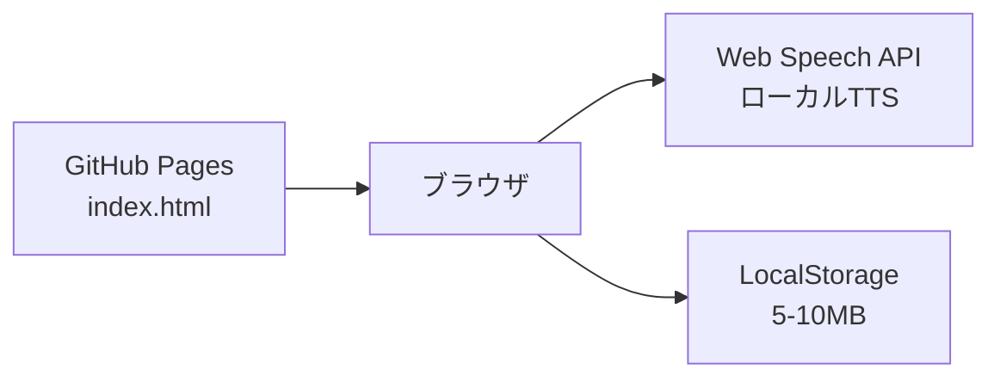

# デプロイガイド（スタンドアロン版）

**バージョン**: 1.0.0  
**日付**: 2026-1-5  
**リポジトリ**: https://github.com/J1921604/Slide-Voice-Maker_standalone

---

## 概要

Slide Voice Maker スタンドアロン版は、**サーバー不要**でブラウザのみで動作するWebアプリケーションです。GitHub Pagesで公開されたindex.htmlをブラウザで開くだけで利用できます。

---

## アーキテクチャ

- **フロントエンド**: 静的 `index.html` を GitHub Pages で配信
- **音声合成**: ブラウザ標準の Web Speech API（リアルタイムTTS）
- **ストレージ**: LocalStorage（プロジェクトデータ自動保存）

---

## GitHub Pages デプロイ手順

### 自動デプロイ（推奨）

1. `main` ブランチへ push すると `.github/workflows/pages.yml` ワークフローが自動実行されます
2. ワークフローは `index.html`, `input/`, `docs/`, `specs/`, `README.md` を `dist/` にコピーし、GitHub Pagesへ公開します
3. 公開URLは Actions 実行ログの `page_url` を参照してください

**公開URL**: https://j1921604.github.io/Slide-Voice-Maker_standalone/

### 手動トリガー

- GitHub Actions 画面で `Deploy GitHub Pages` を選択し、`Run workflow` をクリック

---

## ローカル実行

エクスプローラーで `index.html` をダブルクリックするだけで動作します。

---

## 動作手順

### 初期画面
アプリ起動時に以下のデフォルトファイルが自動読み込みされます：
- `input/AIドリブン開発・教育体制の構築.pdf`
- `input/原稿.csv`

### 基本操作

1. **PDF入力**: ヘッダー左の「PDFファイルを選択」ボタンでPDFをアップロード
2. **原稿CSV入力**: 「原稿CSVを選択」ボタンでCSVを読み込み（`index,script`形式）
3. **TTS再生**: 「TTS再生」ボタンでブラウザのWeb Speech APIで音声再生
4. **原稿編集**: 下部のテキストエリアで原稿を編集（LocalStorageに自動保存・次回起動時に復元）
5. **CSV出力**: 「CSV出力」ボタンで編集した原稿をダウンロード
6. **PPTX出力**: 「PPTX出力」ボタンでスライド画像をPowerPoint形式でダウンロード

---

## 制限事項

| 項目 | 制限内容 | 理由 |
|------|----------|------|
| 音声ファイル生成 | 不可（リアルタイム再生のみ） | Web Speech APIはリアルタイム再生専用 |
| 動画生成 | 不可 | ブラウザ単独ではFFmpegが使えない |
| inputフォルダ保存 | 不可 | ブラウザのセキュリティ制限 |
| データ容量 | LocalStorage上限（5-10MB） | ブラウザのストレージ制限 |

---

## トラブルシューティング

### PDFが読み込めない
- PDFファイルが破損していないか確認してください
- ファイルサイズが大きすぎる場合（50MB以上）は、ページ数を減らしてください
- ブラウザのコンソール（F12）でエラーメッセージを確認してください

### 音声が再生されない
- ブラウザがWeb Speech APIに対応しているか確認してください（Chrome/Edge推奨）
- ブラウザの音声設定を確認してください
- 原稿欄にテキストが入力されているか確認してください

### プロジェクトが保存されない
- LocalStorageが有効になっているか確認してください（プライベートブラウジングモードでは無効）
- ブラウザのストレージ上限（5-10MB）を超えていないか確認してください
- ブラウザのコンソール（F12）でエラーメッセージを確認してください

### デフォルトファイルが読み込めない
- GitHub Pagesで公開されている場合、`input/`フォルダがデプロイされているか確認してください
- ローカルで開いている場合、`input/`フォルダに以下のファイルが存在するか確認してください：
  - `AIドリブン開発・教育体制の構築.pdf`
  - `原稿.csv`

---

## 動作環境

| 項目 | 要件 |
|------|------|
| OS | Windows 10/11, macOS, Linux |
| ブラウザ | Chrome 90+, Edge 90+, Firefox 88+ |
| メモリ | 4GB以上推奨 |
| ストレージ | 100MB以上の空き容量 |

### 推奨ブラウザ

- **Chrome / Edge**: Web Speech API対応、最も安定動作
- **Firefox**: 一部音声合成機能に制限あり
- **Safari**: Web Speech API非対応（音声再生不可）

---

## リンク

- **GitHub Repository**: https://github.com/J1921604/Slide-Voice-Maker_standalone
- **GitHub Pages**: https://j1921604.github.io/Slide-Voice-Maker_standalone/
- **完全仕様書**: https://github.com/J1921604/Slide-Voice-Maker_standalone/blob/main/docs/完全仕様書.md
- **README**: https://github.com/J1921604/Slide-Voice-Maker_standalone/blob/main/README.md
- **タスク一覧**: https://github.com/J1921604/Slide-Voice-Maker_standalone/blob/main/specs/001-Slide-Voice-Maker/tasks.md
