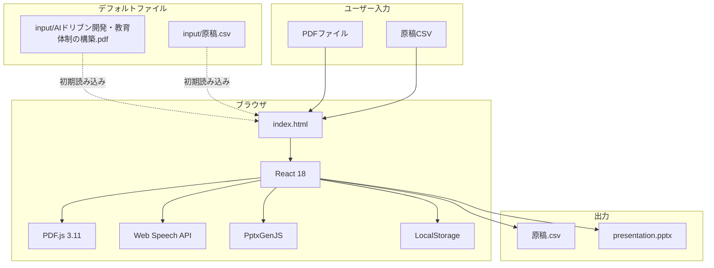
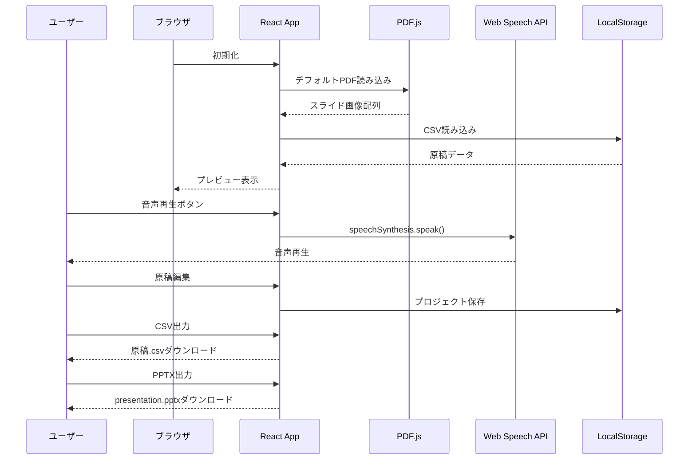
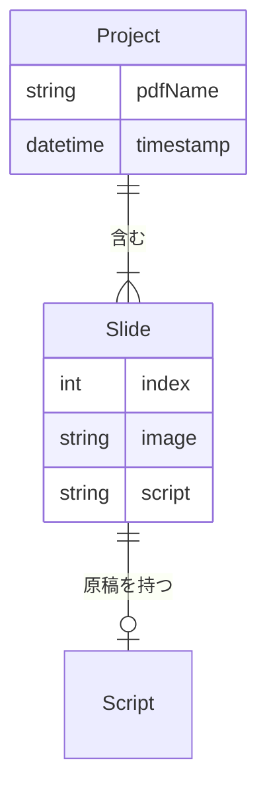
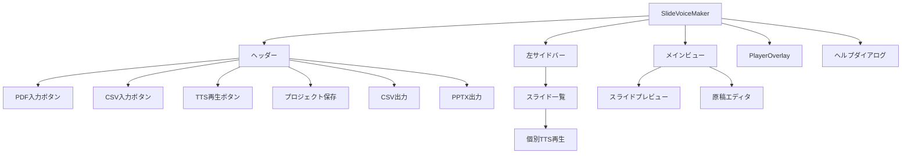

# Slide Voice Maker 完全仕様書

**バージョン**: 1.0.0  
**日付**: 2026-1-5  
**リポジトリ**: https://github.com/J1921604/Slide-Voice-Maker_standalone

---

## 目次

1. [概要](#概要)
2. [スタンドアロン版仕様](#スタンドアロン版仕様)
3. [システムアーキテクチャ](#システムアーキテクチャ)
4. [機能仕様](#機能仕様)
5. [データモデル](#データモデル)
6. [Web UI仕様](#web-ui仕様)
7. [ファイル構造](#ファイル構造)
8. [テスト](#テスト)

---

## 概要

Slide Voice MakerはPDFスライドと原稿CSV（`index,script`形式）から、**ブラウザ上で音声（Web Speech API）付きプレゼンテーション**を作成できるツールです。サーバー不要でindex.htmlをブラウザで開くだけで動作します。

---

## スタンドアロン版仕様

### 概要

ブラウザ上でPDFスライドと原稿CSVから**音声付きプレゼンテーション**を作成できるツールです。サーバーやPython等のランタイムが不要で、index.htmlをブラウザで開くだけで動作します。

### 主要機能

| 機能 | 説明 |
|------|------|
| PDF入力 | PDFファイルをアップロードしてスライド画像に変換 |
| CSV入力 | 原稿CSVを読み込んで各スライドのナレーション原稿を設定 |
| デフォルトファイル自動読み込み | 初期画面で`input/AIドリブン開発・教育体制の構築.pdf`と`input/原稿.csv`を自動読み込み |
| 音声再生 | Web Speech APIでブラウザ上で音声を再生（リアルタイム） |
| 原稿編集 | ブラウザ上で原稿を編集してリアルタイムプレビュー |
| CSV出力 | 編集した原稿をCSVファイルとしてダウンロード |
| PPTX出力 | スライド画像をPowerPointファイル（PPTX）として出力 |
| 自動保存 | LocalStorageに編集内容を自動保存（前回状態を起動時に復元） |

### 技術スタック

| 項目 | 技術 |
|------|------|
| UIフレームワーク | React 18（CDN: unpkg.com） |
| JSXトランスパイル | Babel Standalone 7.28.5 |
| PDF表示 | PDF.js 3.11.174 |
| PowerPoint生成 | PptxGenJS |
| スタイリング | Tailwind CSS（CDN） |
| 音声合成 | Web Speech API |
| ストレージ | LocalStorage API（5-10MB制限） |

### 制限事項

| 項目 | 制限内容 | 理由 |
|------|----------|------|
| 音声ファイル生成 | 不可（リアルタイム再生のみ） | Web Speech APIはリアルタイム再生専用 |
| 動画生成 | 不可 | ブラウザ単独ではFFmpegが使えない |
| inputフォルダ保存 | 不可 | ブラウザのセキュリティ制限 |
| データ容量 | LocalStorage上限（5-10MB） | ブラウザのストレージ制限 |

---

## システムアーキテクチャ

### 全体構成図



### データフロー



---

## 機能仕様

### FR-001: PDF入力

**説明**: PDFファイルをアップロードしてスライド画像に変換

**実装**:
- PDF.js 3.11.174を使用してPDFを画像化（scale=2.0）
- 各ページをPNG形式のData URLに変換
- スライド配列に格納

**制約**:
- 最大サイズ: ブラウザメモリ制限（通常100MB程度）
- 対応形式: PDF 1.0 - 1.7

### FR-002: CSV入力

**説明**: 原稿CSVを読み込んで各スライドのナレーション設定

**CSV形式**:
```csv
index,script
0,"最初のスライドの原稿テキスト"
1,"2番目のスライドの原稿（複数行可）"
```

**対応エンコーディング**:
1. UTF-8
2. UTF-8 BOM
3. Shift_JIS
4. EUC-JP
5. ISO-2022-JP

### FR-003: デフォルトファイル自動読み込み

**説明**: 初期画面で`input/AIドリブン開発・教育体制の構築.pdf`と`input/原稿.csv`を自動読み込み

**実装**:
```javascript
useEffect(() => {
    const loadDefaultFiles = async () => {
        const pdfResponse = await fetch('input/AIドリブン開発・教育体制の構築.pdf');
        const csvResponse = await fetch('input/原稿.csv');
        // ... 読み込み処理
    };
    loadDefaultFiles();
}, []);
```

### FR-004: 音声再生（Web Speech API）

**説明**: ブラウザ標準のTTSエンジンで音声を再生

**実装**:
```javascript
const utterance = new SpeechSynthesisUtterance(text);
utterance.rate = speechRate;
utterance.voice = speechVoice;
window.speechSynthesis.speak(utterance);
```

**制約**:
- 音声ファイル生成不可（リアルタイム再生のみ）
- 音声品質はブラウザ・OSに依存

### FR-005: プロジェクト保存（LocalStorage）

**説明**: プロジェクトデータをブラウザに保存

**保存内容**:
- PDFファイル名
- スライド画像（Data URL）
- 原稿テキスト
- タイムスタンプ

**容量制限**:
- 5-10MB（ブラウザ依存）
- 超過時はエラーハンドリング

### FR-006: CSV出力

**説明**: 編集した原稿をCSVファイルとしてダウンロード

**出力形式**:
- UTF-8 BOM付き
- RFC 4180準拠（引用符エスケープ対応）

### FR-007: PPTX出力

**説明**: スライド画像をPowerPointファイル（PPTX）として出力

**実装**:
- PptxGenJSを使用
- 16:9レイアウト（13.333 x 7.5 inch）
- 各スライドのノート欄に原稿を挿入

---

## データモデル

### エンティティ関係図



### エンティティ定義

#### Project

| 属性 | 型 | 説明 |
|------|-----|------|
| pdfName | string | PDFファイル名 |
| slides | array | スライド配列 |
| timestamp | number | 保存タイムスタンプ |

#### Slide

| 属性 | 型 | 説明 |
|------|-----|------|
| id | string | UUID |
| image | string | Data URL（PNG） |
| script | string | 原稿テキスト |
| audio | null | （将来拡張用） |

---

## Web UI仕様

### 技術スタック

| 項目 | 技術 |
|------|------|
| UIフレームワーク | React 18（CDN） |
| JSXトランスパイル | Babel Standalone 7.28.5（data-presets="env,react"） |
| スタイリング | Tailwind CSS（CDN） |
| PDF表示 | PDF.js 3.11.174 |
| PPTX生成 | PptxGenJS |
| アイコン | SVGインライン |

### UIコンポーネント構成



### デザインガイドライン

**カラーパレット**:
- ベース: `bg-slate-950`（黒）
- アクセント: `orange-500` - `orange-600`（オレンジ）
- テキスト: `amber-200`（明るいオレンジ）

**エレクトロメカニカルデザイン**:
- 金属的グラデーション
- 3Dボーダー効果
- グロー・シャドウ効果
- 立体的なパネル

---

## ファイル構造

```
Slide-Voice-Maker_standalone/
├── index.html              # スタンドアロンWebアプリ（1ファイル完結）
├── README.md               # プロジェクト説明
│
├── input/
│   ├── AIドリブン開発・教育体制の構築.pdf  # デフォルトPDF
│   └── 原稿.csv            # デフォルト原稿
│
├── specs/
│   └── 001-Slide-Voice-Maker/
│       ├── spec.md         # 機能仕様書
│       ├── plan.md         # 実装計画
│       ├── tasks.md        # タスク一覧
│       ├── research.md     # 調査結果
│       └── quickstart.md   # クイックスタート
│
├── docs/
│   ├── 完全仕様書.md       # 本ファイル
│   ├── DEPLOY_GUIDE.md     # デプロイガイド
│   ├── プロンプト.md       # 開発プロンプト
│   └── 導入フロー.md       # 導入フロー
│
├── .specify/
│   └── memory/
│       └── constitution.md # プロジェクト憲法
│
├── .github/
│   ├── workflows/
│   │   └── pages.yml       # GitHub Pages自動デプロイ
│   └── copilot-commit-message-instructions.md
│
└── tests/
    └── e2e/
        └── test_standalone.py  # E2Eテスト
```

---

## テスト

### E2Eテスト

**テストフレームワーク**: pytest

**テストファイル**: `tests/e2e/test_standalone.py`

**テストケース**:

| ID | テスト名 | 検証内容 |
|----|----------|----------|
| T001 | test_standalone_index_html_exists | index.html存在確認 |
| T002 | test_standalone_index_html_has_standalone_mode | STANDALONE_MODE = true確認 |
| T003 | test_standalone_index_html_has_required_cdn_libraries | CDNライブラリ読み込み確認 |
| T004 | test_standalone_index_html_has_web_speech_api | Web Speech API使用確認 |
| T005 | test_standalone_index_html_has_localstorage | LocalStorage使用確認 |
| T006 | test_standalone_index_html_has_pdfjs_integration | PDF.js統合確認 |
| T007 | test_standalone_index_html_has_pptx_export | PPTX出力機能確認 |
| T008 | test_standalone_index_html_has_csv_export | CSV出力機能確認 |
| T009 | test_standalone_index_html_no_backend_dependency | バックエンド依存削除確認 |
| T010 | test_standalone_index_html_has_babel_presets | Babel設定確認 |
| T011 | test_standalone_index_html_valid_html | HTML構造確認 |
| T012 | test_standalone_index_html_meta_charset_utf8 | UTF-8エンコーディング確認 |

**実行方法**:
```bash
py -3.10 -m pytest tests/e2e/test_standalone.py -v
```

---

## 関連リンク

- **リポジトリ**: [https://github.com/J1921604/Slide-Voice-Maker_standalone](https://github.com/J1921604/Slide-Voice-Maker_standalone)
- **GitHub Pages**: [https://j1921604.github.io/Slide-Voice-Maker_standalone/](https://j1921604.github.io/Slide-Voice-Maker_standalone/)
- **機能仕様書**: [https://github.com/J1921604/Slide-Voice-Maker_standalone/blob/main/specs/001-Slide-Voice-Maker/spec.md](https://github.com/J1921604/Slide-Voice-Maker_standalone/blob/main/specs/001-Slide-Voice-Maker/spec.md)
- **実装計画**: [https://github.com/J1921604/Slide-Voice-Maker_standalone/blob/main/specs/001-Slide-Voice-Maker/plan.md](https://github.com/J1921604/Slide-Voice-Maker_standalone/blob/main/specs/001-Slide-Voice-Maker/plan.md)
- **タスク一覧**: [https://github.com/J1921604/Slide-Voice-Maker_standalone/blob/main/specs/001-Slide-Voice-Maker/tasks.md](https://github.com/J1921604/Slide-Voice-Maker_standalone/blob/main/specs/001-Slide-Voice-Maker/tasks.md)

---

**以上**
