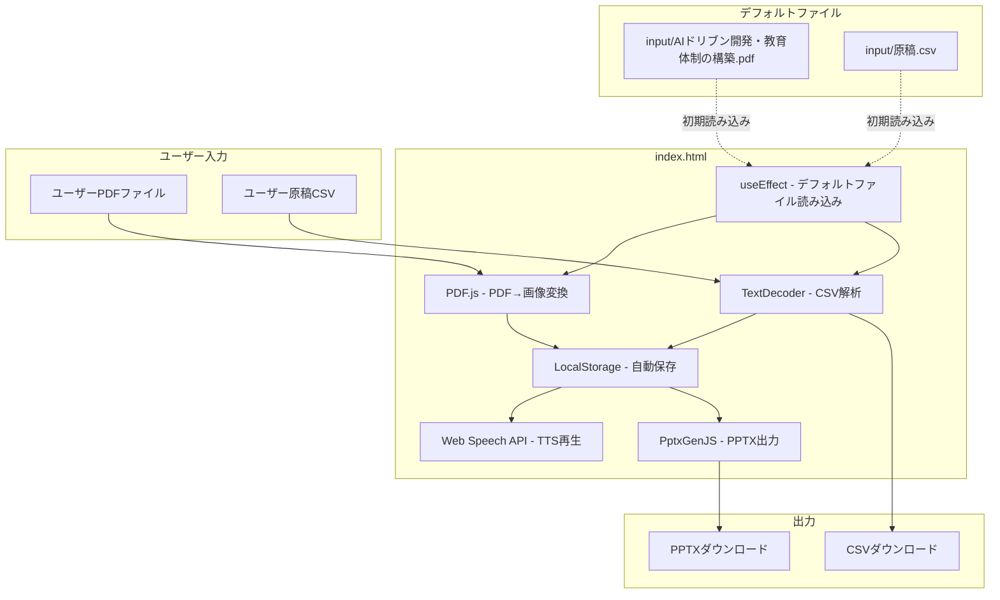
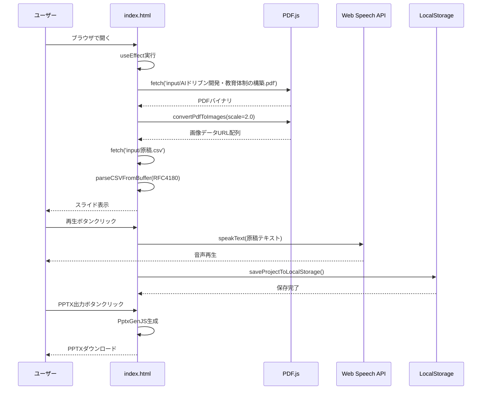
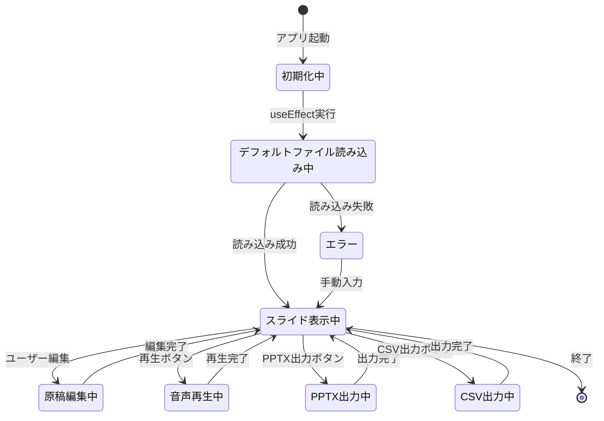

# 実装計画: Slide Voice Maker

**ブランチ**: `001-Slide-Voice-Maker`  
**日付**: 2026-1-5  
**バージョン**: 1.0.0  
**リポジトリ**: https://github.com/J1921604/Slide-Voice-Maker_standalone  
**仕様**: https://github.com/J1921604/Slide-Voice-Maker_standalone/blob/main/specs/001-Slide-Voice-Maker/spec.md

## 概要

本計画は、Slide Voice Makerスタンドアロン版の実装計画である:

1. **デフォルトファイル自動読み込み**: 初期画面で`input/AIドリブン開発・教育体制の構築.pdf`と`input/原稿.csv`を自動読み込み
2. **ブラウザTTS音声再生**: Web Speech APIでリアルタイム音声再生
3. **PDF入力**: PDFファイルをブラウザ内で画像化してスライド表示
4. **CSV入力**: 原稿CSVを読み込んで各スライドのナレーション設定
5. **原稿編集**: ブラウザ上で原稿を編集してリアルタイムプレビュー
6. **CSV出力**: 編集した原稿をCSVファイルとしてダウンロード
7. **PPTX出力**: スライド画像をPowerPointファイル（PPTX）として出力
8. **自動保存**: LocalStorageに編集内容を自動保存（前回状態を起動時に復元）

加えて、運用上の要件として以下も満たす:

- **サーバー不要**: ブラウザのみで動作（Python不要）
- **CDN依存関係**: 全依存関係をCDN経由で提供（インストール不要）
- **GitHub Pages自動デプロイ**: GitHub Actionsでindex.htmlを自動デプロイ
- 変更内容を **E2Eテストへ反映**し、検証可能にする

## 技術コンテキスト

**言語/バージョン**: JavaScript（ES6+）、React 18
**主要依存関係**: React 18, PDF.js 3.11.174, PptxGenJS, Web Speech API, LocalStorage API
**ストレージ**: LocalStorage（5-10MB制限）
**テスト**: pytest + Selenium
**ターゲットプラットフォーム**: モダンブラウザ（Chrome, Edge, Firefox）
**プロジェクト種別**: single（HTML単独）
**パフォーマンス目標**: デフォルトファイル読み込み3秒以内
**制約**: UTF-8エンコーディング必須、LocalStorage容量制限5-10MB
**規模/スコープ**: 個人/小規模チーム向け、1～100ページのPDF対応

## 憲法チェック

| 原則 | 確認項目 | 状態 |
|------|----------|------|
| I. テスト駆動開発 | テスト作成計画が含まれているか | ✅ |
| II. セキュリティ最優先 | セキュリティ要件が機能要件より優先されているか | ✅ |
| III. パフォーマンス基準 | 定量的なパフォーマンス目標が定義されているか | ✅ |
| IV. 品質と一貫性 | UTF-8エンコーディング、依存バージョン固定が確認されているか | ✅ |
| V. シンプルさの追求 | YAGNI原則に従い、複雑さの正当化が必要か | ✅ |

**制約確認**:

- [x] 機密データの平文保存がないこと
- [x] 外部依存がCDN経由で提供されていること
- [x] 仕様と実装の乖離がレビューで検知可能であること

## プロジェクト構造

### ドキュメント（本機能）

```text
specs/001-Slide-Voice-Maker/
├── spec.md              # 機能仕様書
├── plan.md              # 本ファイル（実装計画）
├── tasks.md             # タスク一覧
├── research.md          # 調査結果（Phase 0出力）
├── quickstart.md        # クイックスタート（Phase 1出力）
└── contracts/           # API契約（不要）
```

### ソースコード（リポジトリルート）

```text
Slide-Voice-Maker/
├── index.html           # スタンドアロンWebアプリ本体
├── preview.bat          # プレビュー起動
├── input/
│   ├── AIドリブン開発・教育体制の構築.pdf  # デフォルトPDF
│   └── 原稿.csv                            # デフォルト原稿
├── docs/
│   ├── 完全仕様書.md
│   └── README.md
└── tests/
    └── e2e/
        └── test_standalone.py   # スタンドアロンE2Eテスト

pytest.ini               # pytest設定（markers等）
.github/workflows/pages.yml  # GitHub Pages自動デプロイ
```

## 実装アーキテクチャ



## データフロー



## 状態遷移



## 複雑さの追跡

本実装は既存コードへの最小限の変更で実現するため、追加の複雑さはない。

| 項目 | 判定 |
|------|------|
| 新規パターン導入 | なし（React標準パターン） |
| 外部依存追加 | なし（CDN経由） |
| アーキテクチャ変更 | なし（単一HTML） |

## Phase 0: 調査

### 解決済み事項

| 項目 | 決定 | 根拠 |
|------|------|------|
| デフォルトファイル読み込み | useEffect + fetch | React標準パターン |
| PDF処理 | PDF.js 3.11.174 (scale=2.0) | ブラウザ標準、実績あり |
| 音声再生 | Web Speech API | ブラウザ標準、リアルタイム再生 |
| ストレージ | LocalStorage | ブラウザ標準、5-10MB容量 |
| PPTX出力 | PptxGenJS | 実績あるライブラリ |

### 調査結果

- デフォルトファイルは`input/AIドリブン開発・教育体制の構築.pdf`と`input/原稿.csv`
- PDF.jsはscale=2.0で高解像度画像生成
- Web Speech APIはChrome/Edge/Firefoxで標準サポート
- LocalStorageは5-10MB制限（約50ページのPDF対応可能）

## Phase 1: 設計

### デフォルトファイル自動読み込み機能

**index.html**:
- `useEffect(() => { loadDefaultFiles(); }, [])` で初期読み込み
- `fetch('input/AIドリブン開発・教育体制の構築.pdf')` でPDF取得
- `fetch('input/原稿.csv')` でCSV取得
- `convertPdfToImages(pdfArrayBuffer)` でPDF→画像変換
- `parseCSVFromBuffer(csvArrayBuffer)` でCSV解析（RFC4180対応）
- `setSlides()` でスライド設定、`setSavedPdfName()` でファイル名保存
- エラー時: `setStatusMessage('デフォルトファイルを読み込めませんでした')`

### Web Speech API音声再生機能

**index.html**:
- `const synth = window.speechSynthesis;`
- `const utterance = new SpeechSynthesisUtterance(text);`
- `utterance.lang = 'ja-JP';`
- `synth.speak(utterance);`

## Phase 2: 実装

タスク詳細は https://github.com/J1921604/Slide-Voice-Maker_standalone/blob/main/specs/001-Slide-Voice-Maker/tasks.md を参照。

## 検証計画

| テスト種別 | 内容 | 担当 |
|------------|------|------|
| E2Eテスト | デフォルトファイル自動読み込み | 自動（pytest + Selenium） |
| E2Eテスト | Web Speech API音声再生 | 自動（pytest + Selenium） |
| E2Eテスト | PPTX出力 | 自動（pytest + Selenium） |
| 回帰テスト | 既存機能の動作確認 | 手動 |

## リスクと対策

| リスク | 影響度 | 対策 |
|--------|--------|------|
| デフォルトファイル不在 | 低 | エラーメッセージ表示、手動入力促す |
| LocalStorage容量超過 | 低 | 古いプロジェクトデータを自動削除 |
| Web Speech API非対応ブラウザ | 低 | 警告メッセージ表示 |
| 大きなPDF（100ページ超） | 中 | 進捗表示、LocalStorage制限警告 |

## リンク

- **GitHub Repository**: https://github.com/J1921604/Slide-Voice-Maker_standalone
- **GitHub Pages**: https://j1921604.github.io/Slide-Voice-Maker_standalone/
- **完全仕様書**: https://github.com/J1921604/Slide-Voice-Maker_standalone/blob/main/docs/完全仕様書.md
- **README**: https://github.com/J1921604/Slide-Voice-Maker_standalone/blob/main/README.md
- **タスク一覧**: https://github.com/J1921604/Slide-Voice-Maker_standalone/blob/main/specs/001-Slide-Voice-Maker/tasks.md
