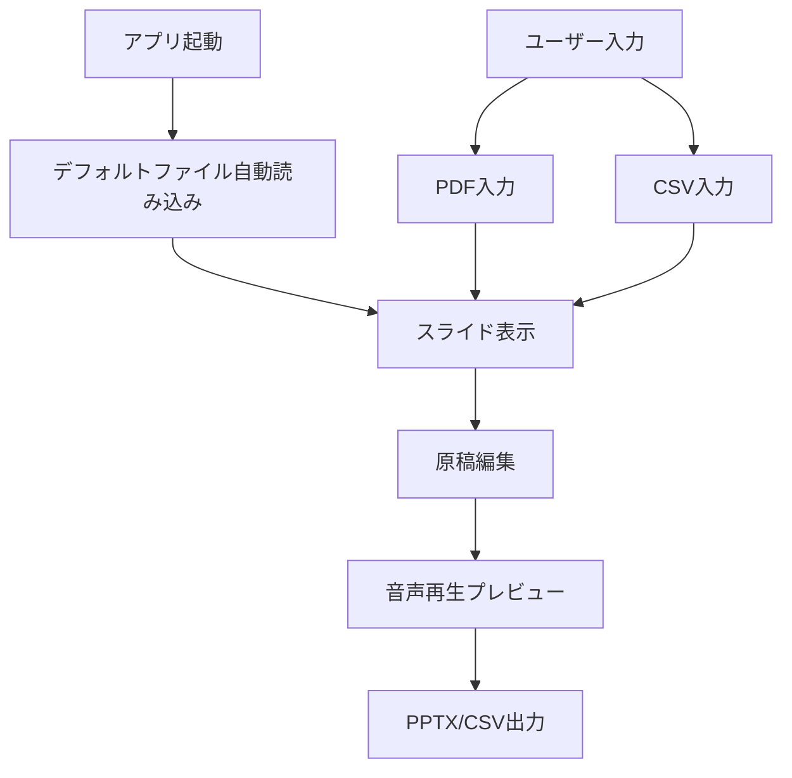
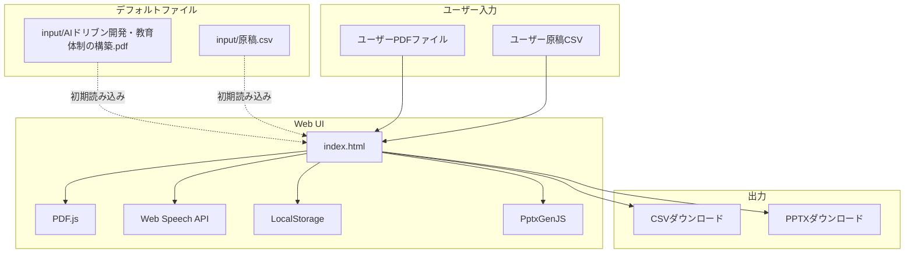
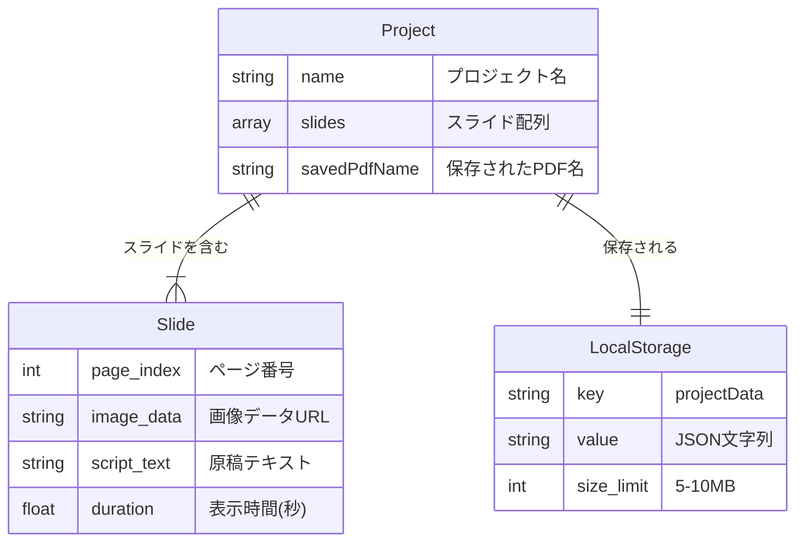

# 機能仕様書: Slide Voice Maker

**機能ブランチ**: `001-Slide-Voice-Maker`  
**作成日**: 2026-1-5  
**バージョン**: 1.0.0  
**状態**: 承認済  
**リポジトリ**: https://github.com/J1921604/Slide-Voice-Maker_standalone

## 概要

Slide Voice Makerは、PDFスライドと原稿CSVからブラウザ上でAI音声ナレーション付きプレゼンテーションを生成するスタンドアロンWebアプリケーションである。

### スタンドアロン版の仕様

本バージョンは以下の機能を提供する:

1. **デフォルトファイル自動読み込み**: 初期画面で`input/AIドリブン開発・教育体制の構築.pdf`と`input/原稿.csv`を自動読み込み
2. **PDF入力**: PDFファイルをブラウザ内で画像化してスライド表示
3. **CSV入力**: 原稿CSVを読み込んで各スライドのナレーション設定
4. **音声再生**: Web Speech APIでリアルタイムTTS再生（音声ファイル生成不可）
5. **原稿編集**: ブラウザ上で原稿を編集してリアルタイムプレビュー
6. **CSV出力**: 編集した原稿をCSVファイルとしてダウンロード
7. **PPTX出力**: スライド画像をPowerPointファイル（PPTX）として出力
8. **自動保存**: LocalStorageに編集内容を自動保存（前回状態を起動時に復元）

## プロセスフロー

## システムアーキテクチャ

### ユーザーストーリー1 - デフォルトファイル自動読み込み（優先度: P1）

ユーザーはアプリ起動時に自動的にデフォルトファイルが読み込まれ、すぐにプレゼンテーションを確認できる。

**この優先度の理由**: 初回ユーザー体験の向上と、サンプルファイルの即座な確認のため最優先。

**独立テスト**: index.htmlを開いた直後に、デフォルトPDFとCSVが自動読み込みされ、スライド表示されることを確認する。

**受入シナリオ**:

| 前提条件 | 操作 | 期待結果 |
|----------|------|----------|
| input/にデフォルトファイルが存在する | index.htmlを開く | デフォルトファイルが自動読み込みされスライド表示 |
| input/にデフォルトファイルが存在しない | index.htmlを開く | エラーメッセージ表示、手動入力は可能 |

---

### ユーザーストーリー2 - ブラウザTTS音声再生（優先度: P1）

ユーザーはブラウザ上で原稿テキストを選択し、Web Speech APIで即座に音声再生できる。

**この優先度の理由**: リアルタイムプレビューによる編集効率向上のため最優先。

**独立テスト**: スライドを選択し再生ボタンをクリックして、Web Speech APIで音声が再生されることを確認する。

**受入シナリオ**:

| 前提条件 | 操作 | 期待結果 |
|----------|------|----------|
| 原稿が入力されている | 再生ボタンをクリック | Web Speech APIで音声再生される |
| 原稿が空 | 再生ボタンをクリック | エラーメッセージ表示 |

---

### エッジケース

- デフォルトファイルが存在しない場合、エラーメッセージを表示して手動入力を促す
- LocalStorage容量超過時、古いプロジェクトデータを自動削除
- 非常に大きなPDF（100ページ超）の場合、進捗表示を行う
- Web Speech API非対応ブラウザの場合、警告メッセージを表示

## 機能要件

| ID | 要件 | 優先度 |
|----|------|--------|
| FR-001 | システムは起動時にinput/AIドリブン開発・教育体制の構築.pdfを自動読み込みしなければならない | P1 |
| FR-002 | システムは起動時にinput/原稿.csvを自動読み込みしなければならない | P1 |
| FR-003 | システムはデフォルトファイル読み込み失敗時にエラーメッセージを表示しなければならない | P1 |
| FR-004 | システムはPDFファイルをブラウザ内で画像化（scale=2.0）しなければならない | P1 |
| FR-005 | システムは原稿CSVをRFC4180形式で解析しなければならない | P1 |
| FR-006 | システムはWeb Speech APIでリアルタイム音声再生を提供しなければならない | P1 |
| FR-007 | システムはLocalStorageにプロジェクトデータを自動保存しなければならない | P1 |
| FR-008 | システムは編集した原稿をCSVファイルとしてダウンロード可能にしなければならない | P1 |
| FR-009 | システムはスライド画像をPPTXファイル（16:9レイアウト）として出力しなければならない | P1 |
| FR-010 | システムはUTF-8エンコーディングで全ファイルを処理しなければならない | P1 |

## 主要エンティティ

## 成功基準

| ID | 基準 | 測定方法 |
|----|------|----------|
| SC-001 | デフォルトファイル自動読み込みが3秒以内に完了する | 処理時間計測 |
| SC-002 | Web Speech API音声再生が即座に開始される | 手動テスト |
| SC-003 | LocalStorageへの自動保存が正常に動作する | E2Eテスト |
| SC-004 | PPTX出力が正常に生成される | E2Eテスト |

## 技術スタック

| 項目 | 技術 |
|------|------|
| UIフレームワーク | React 18 (CDN) |
| スタイリング | Tailwind CSS (CDN) |
| PDF処理 | PDF.js 3.11.174 |
| 音声合成 | Web Speech API |
| PPTX生成 | PptxGenJS |
| ストレージ | LocalStorage API |
| トランスパイル | Babel Standalone 7.28.5 |

## 依存関係

すべての依存関係はCDN経由で提供され、追加のインストールは不要:

- React 18: `https://unpkg.com/react@18/umd/react.production.min.js`
- React DOM 18: `https://unpkg.com/react-dom@18/umd/react-dom.production.min.js`
- Babel Standalone 7.28.5: `https://unpkg.com/@babel/standalone@7.28.5/babel.min.js`
- Tailwind CSS: `https://cdn.tailwindcss.com`
- PDF.js 3.11.174: `https://cdnjs.cloudflare.com/ajax/libs/pdf.js/3.11.174/pdf.min.js`
- PptxGenJS: `https://cdn.jsdelivr.net/npm/pptxgenjs@3.12.0/dist/pptxgen.bundle.js`

## リンク

- **GitHub Repository**: https://github.com/J1921604/Slide-Voice-Maker_standalone
- **GitHub Pages**: https://j1921604.github.io/Slide-Voice-Maker_standalone/
- **完全仕様書**: https://github.com/J1921604/Slide-Voice-Maker_standalone/blob/main/docs/完全仕様書.md
- **README**: https://github.com/J1921604/Slide-Voice-Maker_standalone/blob/main/README.md
