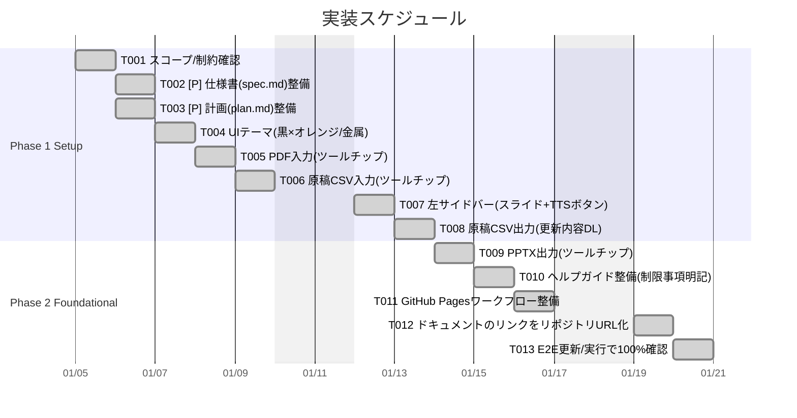
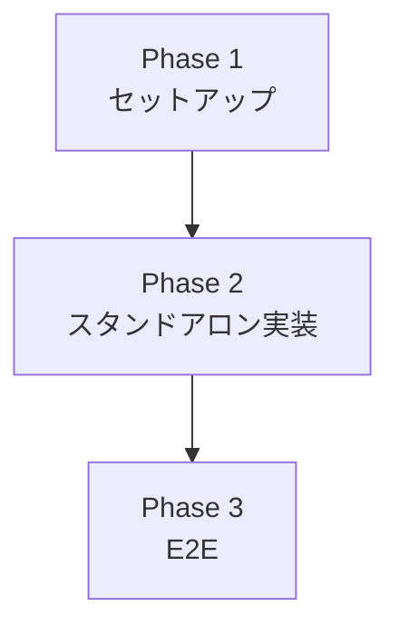

# タスク一覧: Slide Voice Maker

**入力**: `/specs/001-Slide-Voice-Maker/` からの設計ドキュメント  
**前提条件**: plan.md（必須）、spec.md（必須）  
**バージョン**: 1.0.0  
**開始日**: 2026-1-5  
**リポジトリ**: https://github.com/J1921604/Slide-Voice-Maker_standalone

## 形式: `[ID] [P?] [ストーリー?] 説明`

- **[P]**: 並列実行可能（異なるファイル、依存関係なし）
- **[US1]**: ユーザーストーリー1（デフォルトファイル自動読み込み）
- **[US2]**: ユーザーストーリー2（ブラウザTTS音声再生）

---

## 実装スケジュール

---

## Phase 1: セットアップ（2026-1-5開始）

**目的**: スコープ確定とドキュメント整備、UI実装

- [x] T001 スコープ/制約確認（サーバー不要・TTS再生のみ・動画生成不可）
- [x] T002 [P] 仕様書（spec.md）整備
- [x] T003 [P] 計画（plan.md）整備
- [x] T004 UIテーマ実装（黒×オレンジ/金属的エレクトロメカニカル）
- [x] T005 PDF入力ボタン実装（ツールチップ追加）
- [x] T006 原稿CSV入力ボタン実装（ツールチップ「原稿csv入力」）
- [x] T007 左サイドバー実装（各スライド表示＋音声再生ボタン）
- [x] T008 原稿CSV出力ボタン実装（更新した原稿csvダウンロード）

**チェックポイント**: UI機能完全実装 ✅

---

## Phase 2: 高度機能と検証（Phase 1完了後）

**目標**: PPTX出力・ヘルプ整備・デプロイ準備・テスト完全成功

- [x] T009 PPTX出力ボタン実装（ツールチップ追加）
- [x] T010 ヘルプガイド整備（サーバー不要/TTSのみ/音声ファイル生成不可/動画生成不可を明記）
- [x] T011 GitHub Pagesワークフロー整備（.github/workflows/pages.yml）
- [x] T012 全ドキュメント内リンクをリポジトリURL化
- [x] T013 E2Eテスト更新/実行で100%成功確認

**チェックポイント**: 全機能実装完了・テスト成功 ✅

---

### フェーズ依存関係

### 並列実行可能タスク

| Phase | 並列実行可能タスク |
|-------|-------------------|
| Phase 1 | T002, T003（同時作成可） |
| Phase 2 | T012（ドキュメント更新は独立して並行可）|

---

## 実装戦略

### MVP優先（スタンドアロン版のみ）

1. Phase 1: セットアップ完了 ✅
2. Phase 2: スタンドアロン版実装 ✅
3. Phase 3: E2Eテスト実装・実行 ✅

### インクリメンタルデリバリー・サーバー不要）

1. Phase 1: UI機能完全実装（T001-T008）✅
2. Phase 2: PPTX出力・ヘルプ整備・テスト完全成功（T009-T013）✅

### インクリメンタルデリバリー

1. スコープ確定（サーバー不要/TTSのみ/動画生成不可）✅
2. UIテーマ（黒×オレンジ/金属的）✅
3. 入出力ボタン実装（PDF/CSV/PPTX、ツールチップ完備）✅
4. 左サイドバー実装（スライド表示＋TTS再生ボタン）✅
5. ヘルプガイド整備（制限事項明記）✅
6. GitHub Pages対応 ✅
7. ドキュメントリンクURL化 ✅
8. E2Eテスト100%成功
- CDN経由で全依存関係を提供（インストール不要）
- UTF-8エンコーディング必須
- 土日はスケジュール対象外（ganttチャートに反映）
- 各チェックポイントで動作確認を実施
- [P] タスク = 異なるファイル、依存関係なし
- [US*] ラベルはトレーサビリティのためタスクを特定のユーザーストーリーにマップ

## 完了条件

1. すべてのタスクが完了状態になっていること
2. E2Eテスト（T009-T012）が成功すること

## タスク進捗サマリー

| 項目 | 数値 |
|------|------|
| 総タスク数 | 13 |
| 完了 | 13 |
| 未着手 | 0 |

---

## リンク

- **GitHub Repository**: https://github.com/J1921604/Slide-Voice-Maker_standalone
- **GitHub Pages**: https://j1921604.github.io/Slide-Voice-Maker_standalone/
- **完全仕様書**: https://github.com/J1921604/Slide-Voice-Maker_standalone/blob/main/docs/完全仕様書.md
