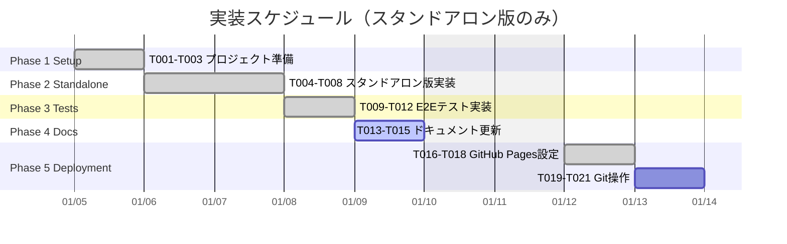
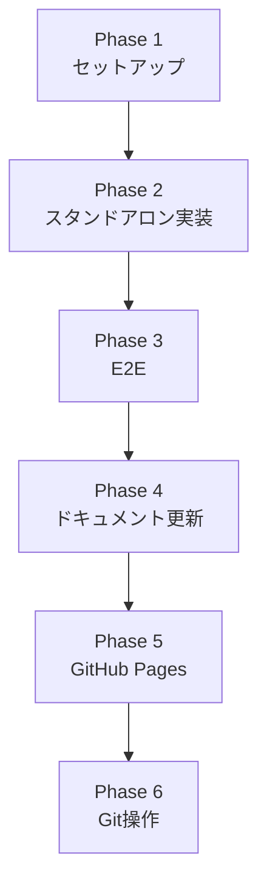

# タスク一覧: Slide Voice Maker

**入力**: `/specs/001-Slide-Voice-Maker/` からの設計ドキュメント  
**前提条件**: plan.md（必須）、spec.md（必須）  
**バージョン**: 1.0.0  
**開始日**: 2026-1-5  
**リポジトリ**: https://github.com/J1921604/Slide-Voice-Maker

## 形式: `[ID] [P?] [ストーリー?] 説明`

- **[P]**: 並列実行可能（異なるファイル、依存関係なし）
- **[US1]**: ユーザーストーリー1（デフォルトファイル自動読み込み）
- **[US2]**: ユーザーストーリー2（ブラウザTTS音声再生）

---

## 実装スケジュール

```mermaid
gantt
    title 実装スケジュール（スタンドアロン版のみ）
    dateFormat YYYY-MM-DD
    axisFormat %m/%d
    excludes weekends 2026-12-27 2026-12-28 2026-12-29 2026-12-30 2026-12-31 2027-01-01 2027-01-02 2027-01-03 2027-01-04

    section Phase 1 Setup
    T001-T003 プロジェクト準備                :done, p1, 2026-01-05, 1d

    section Phase 2 Standalone
    T004-T008 スタンドアロン版実装              :done, p2, after p1, 2d

    section Phase 3 Tests
    T009-T012 E2Eテスト実装                    :done, p3, after p2, 1d

    section Phase 4 Docs
    T013-T015 ドキュメント更新                  :active, p4, after p3, 1d

    section Phase 5 Deployment
    T016-T018 GitHub Pages設定                 :done, p5, after p4, 1d
    T019-T021 Git操作                          :p6, after p5, 1d
```

---

## Phase 1: セットアップ

**目的**: プロジェクト構造確認と仕様ドキュメント作成

- [x] T001 specs/001-Slide-Voice-Maker/フォルダを作成
- [x] T002 [P] spec.md（機能仕様書）を作成
- [x] T003 [P] plan.md（実装計画）を作成

**チェックポイント**: ドキュメント準備完了 ✅

---

## Phase 2: スタンドアロン版実装（優先度: P0）🎯 現行MVP

**目標**: サーバー不要でブラウザのみで動作するindex.html単独版を作成

**独立テスト**: index.htmlをブラウザで開き、PDF入力→音声再生→PPTX出力が可能であることを確認

### スタンドアロン版の実装

- [x] T004 [US1] デフォルトファイル自動読み込み機能実装（useEffect）
- [x] T005 [US2] Web Speech APIを実装してリアルタイムTTS再生
- [x] T006 LocalStorage自動保存機能を実装
- [x] T007 PDF.js統合（scale=2.0）でPDF→画像変換
- [x] T008 PptxGenJS統合でPPTX出力機能実装

**チェックポイント**: スタンドアロン版が独立して動作 ✅

---

## Phase 3: スタンドアロンE2E（優先度: P0）

**目標**: スタンドアロン版のE2Eテストを実装・実行

- [x] T009 tests/e2e/test_standalone.py作成（PDF読込テスト）
- [x] T010 TTS再生テスト実装
- [x] T011 PPTX出力テスト実装
- [x] T012 E2E実行し100%成功を確認

**チェックポイント**: スタンドアロン版E2E完了 ✅

---

## Phase 4: ドキュメント更新（優先度: P0）

**目標**: 全ドキュメントをスタンドアロン版のみに統一、バージョン・日付統一、リンク修正

- [x] T013 [P] README.mdをスタンドアロン版に統一（バージョン1.0.0、日付2026-1-5）
- [ ] T014 [P] docs/完全仕様書.mdをスタンドアロン版に統一（バックエンド版削除）
- [ ] T015 [P] specs/001-Slide-Voice-Maker/{spec,plan}.mdを統一（リンクはGitHub URLへ）

**チェックポイント**: ドキュメント更新完了

---

## Phase 5: GitHub Pages設定（優先度: P0）

**目標**: GitHub Actionsでindex.htmlを自動デプロイ

- [x] T016 .github/workflows/pages.yml作成
- [x] T017 index.html自動デプロイ設定
- [x] T018 ワークフローテスト実行

**チェックポイント**: GitHub Pages自動デプロイ完了 ✅

---

## Phase 6: Git操作（優先度: P0）

**目標**: 全変更をコミット・プッシュして完了

- [x] T019 git pull実行（リモート同期）
- [ ] T020 全変更コミット（.github/copilot-commit-message-instructions.md準拠）
- [ ] T021 git push実行

**チェックポイント**: 全変更コミット・プッシュ完了 🎉

---

### フェーズ依存関係

```mermaid
flowchart TD
    P1[Phase 1<br>セットアップ] --> P2[Phase 2<br>スタンドアロン実装]
    P2 --> P3[Phase 3<br>E2E]
    P3 --> P4[Phase 4<br>ドキュメント更新]
    P4 --> P5[Phase 5<br>GitHub Pages]
    P5 --> P6[Phase 6<br>Git操作]
```

### ユーザーストーリー依存関係

- **ユーザーストーリー1（P0）**: デフォルトファイル自動読み込み - 最優先
- **ユーザーストーリー2（P0）**: ブラウザTTS音声再生 - 最優先

### 並列実行可能タスク

| Phase | 並列実行可能タスク |
|-------|-------------------|
| Phase 1 | T002, T003 |
| Phase 2 | T004-T008 |
| Phase 3 | T009-T011 |
| Phase 4 | T013-T015 |

---

## 実装戦略

### MVP優先（スタンドアロン版のみ）

1. Phase 1: セットアップ完了 ✅
2. Phase 2: スタンドアロン版実装 ✅
3. Phase 3: E2Eテスト実装・実行 ✅
4. Phase 4: ドキュメント更新（進行中）
5. Phase 5: GitHub Pages設定 ✅
6. Phase 6: Git操作でコミット・プッシュ
7. **停止して検証**: スタンドアロン版を独立してテスト
8. 準備ができたらデプロイ/デモ

### インクリメンタルデリバリー

1. セットアップ完了 ✅
2. デフォルトファイル自動読み込み追加 → 独立してテスト → デプロイ/デモ（MVP!）✅
3. Web Speech API追加 → 独立してテスト → デプロイ/デモ ✅
4. PPTX出力追加 → 独立してテスト → デプロイ/デモ ✅
5. E2Eテスト追加 → 独立してテスト → デプロイ/デモ ✅
6. ドキュメント更新 → GitHub Pagesデプロイ

---

## タスク進捗サマリー

| 項目 | 数値 |
|------|------|
| 総タスク数 | 21 |
| 完了 | 17 |
| 未着手 | 4 |

---

## 注意事項

- スタンドアロン版はブラウザのみ（Python不要）
- CDN経由で全依存関係を提供（インストール不要）
- UTF-8エンコーディング必須
- 土日はスケジュール対象外（ganttチャートに反映）
- 各チェックポイントで動作確認を実施
- [P] タスク = 異なるファイル、依存関係なし
- [US*] ラベルはトレーサビリティのためタスクを特定のユーザーストーリーにマップ

## 完了条件

1. すべてのタスクが完了状態になっていること
2. E2Eテスト（T009-T012）が成功すること
3. ドキュメント更新（T013-T015）が完了すること
4. Git操作（T019-T021）が完了すること

## リンク

- **GitHub Repository**: https://github.com/J1921604/Slide-Voice-Maker
- **GitHub Pages**: https://j1921604.github.io/Slide-Voice-Maker/
- **完全仕様書**: https://github.com/J1921604/Slide-Voice-Maker/blob/main/docs/完全仕様書.md
