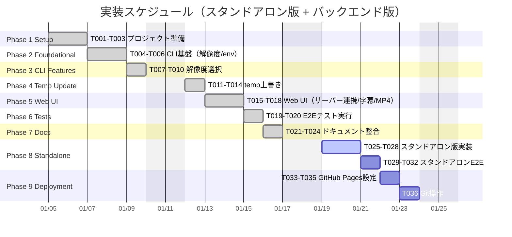
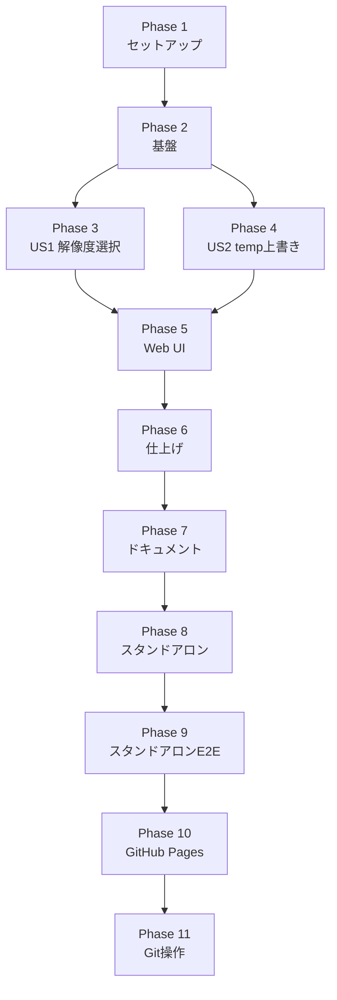

# タスク一覧: Slide Voice Maker

**入力**: `/specs/001-Slide-Voice-Maker/` からの設計ドキュメント
**前提条件**: plan.md（必須）、spec.md（必須）、data-model.md、contracts/
**バージョン**: 1.0.0
**開始日**: 2026-01-05

## 形式: `[ID] [P?] [ストーリー?] 説明`

- **[P]**: 並列実行可能（異なるファイル、依存関係なし）
- **[US1]**: ユーザーストーリー1（解像度選択）
- **[US2]**: ユーザーストーリー2（temp上書き更新）

---

## 実装スケジュール


```mermaid
gantt
    title 実装スケジュール（スタンドアロン版 + バックエンド版）
    dateFormat YYYY-MM-DD
    axisFormat %m/%d
    excludes weekends

    section Phase 1 Setup
    T001-T003 プロジェクト準備                :done, p1, 2026-01-05, 2d

    section Phase 2 Foundational
    T004-T006 CLI基盤（解像度/env）            :done, p2, after p1, 2d

    section Phase 3 CLI Features
    T007-T010 解像度選択                       :done, p3, after p2, 1d

    section Phase 4 Temp Update
    T011-T014 temp上書き                       :done, p4, after p3, 1d

    section Phase 5 Web UI
    T015-T018 Web UI（サーバー連携/字幕/MP4）   :done, p5, after p4, 2d

    section Phase 6 Tests
    T019-T020 E2Eテスト実行                    :done, p6, after p5, 1d

    section Phase 7 Docs
    T021-T024 ドキュメント整合                  :done, p7, after p6, 1d

    section Phase 8 Standalone
    T025-T028 スタンドアロン版実装              :active, p8, after p7, 2d
    T029-T032 スタンドアロンE2E                 :p9, after p8, 1d

    section Phase 9 Deployment
    T033-T035 GitHub Pages設定                 :p10, after p9, 1d
    T036 Git操作                               :p11, after p10, 1d
```

---

## Phase 1: セットアップ

**目的**: プロジェクト構造確認と仕様ドキュメント作成

- [x] T001 specs/001-Slide-Voice-Maker/フォルダを作成
- [x] T002 [P] spec.md（機能仕様書）を作成
- [x] T003 [P] plan.md（実装計画）を作成

**チェックポイント**: ドキュメント準備完了 ✅

---

## Phase 2: 基盤（ブロッキング前提条件）

**目的**: 解像度選択・temp管理の共通インフラ構築

**⚠️ 重要**: このフェーズが完了するまでユーザーストーリー作業は開始不可

- [x] T004 src/main.pyにRESOLUTION_MAP定数を定義（720p/1080p/1440p→幅ピクセル）
- [x] T005 [P] src/main.pyに--resolution引数をargparseに追加
- [x] T006 [P] 環境変数OUTPUT_MAX_WIDTHへの変換処理を実装

**チェックポイント**: 基盤準備完了 - ユーザーストーリー実装を開始可能 ✅

---

## Phase 3: ユーザーストーリー1 - 解像度選択（優先度: P1）🎯 MVP

**目標**: ユーザーが動画生成前に出力解像度（720p/1080p/1440p）を選択可能にする

**独立テスト**: `py -3.10 src/main.py --resolution 1080p`を実行し、出力動画の解像度が1920x1080であることをFFprobeで確認

### ユーザーストーリー1の実装

- [x] T007 [US1] src/main.pyで--resolution引数をパースしRESOLUTION_MAPから幅を取得
- [x] T008 [US1] src/main.pyで取得した幅をos.environ["OUTPUT_MAX_WIDTH"]に設定
- [x] T009 [US1] src/processor.pyの_get_output_max_width()が環境変数を正しく読み取ることを確認
- [x] T010 [US1] 無効な解像度値の場合は720p（デフォルト）にフォールバックするバリデーション追加

**チェックポイント**: 解像度選択機能が独立して動作 ✅

---

## Phase 4: ユーザーストーリー2 - temp上書き更新（優先度: P1）

**目標**: 毎回の実行時にtempフォルダを自動クリアし、古いファイルを残さない

**独立テスト**: 2回連続で動画生成を実行し、output/temp/内に1回目のファイルが残っていないことを確認

### ユーザーストーリー2の実装

- [x] T011 [US2] src/processor.pyにclear_temp_folder(temp_dir)関数を追加
- [x] T012 [US2] clear_temp_folder()内でshutil.rmtree()とos.makedirs()を使用
- [x] T013 [US2] process_pdf_and_script()の冒頭でclear_temp_folder()を呼び出し
- [x] T014 [P] [US2] PermissionError時のエラーハンドリングとログ出力追加

**チェックポイント**: temp上書き機能が独立して動作 ✅

---

## Phase 5: Web UI（優先度: P1）

**目標**: サーバー（src/server.py）と連携するWeb UI

**独立テスト**: index.htmlでPDF/CSV入力→音声生成→WebMダウンロードが可能であることを確認

### Web UIの実装

- [x] T015 index.htmlにRESOLUTION_OPTIONS配列を定義（label, value, width, height）
- [x] T016 index.htmlにサーバー連携機能を実装（PDF/CSVアップロード、動画生成、ダウンロード）
- [x] T017 src/server.pyにFastAPIエンドポイントを実装（PDF/CSVアップロード、動画生成、ファイル一覧、ダウンロード）
- [x] T018 CSV文字化け対処をTextDecoderベースに強化（UTF-8/Shift_JIS等 + RFC4180最小対応）

**チェックポイント**: Web UIが独立して動作 ✅

---

## Phase 6: 仕上げとテスト

**目的**: E2Eテスト実行、ドキュメント更新、最終検証

- [x] T019 [P] tests/e2e/test_resolution.pyでCLI E2Eテスト（解像度・非空WebM確認）
- [x] T020 [P] tests/e2e/test_local_backend.pyでバックエンドE2Eテスト
- [x] T021 [P] README.mdを要件/テスト/実行手順に整合
- [x] T022 [P] docs/完全仕様書.mdを現行仕様に整合
- [x] T023 [P] specs/001-Slide-Voice-Maker/{spec,plan,quickstart}.mdを整合（リンクはGitHub URLへ）
- [x] T024 E2Eを実行し100%成功を確認

## Phase 7: ドキュメント整合（完了）

- [x] T021 [P] README.mdを要件/テスト/実行手順に整合
- [x] T022 [P] docs/完全仕様書.mdを現行仕様に整合
- [x] T023 [P] specs/001-Slide-Voice-Maker/{spec,plan,quickstart}.mdを整合（リンクはGitHub URLへ）
- [x] T024 E2Eを実行し100%成功を確認

**チェックポイント**: バックエンド版完了 ✅

---

## Phase 8: スタンドアロン版実装（優先度: P0）🎯 現行MVP

**目標**: サーバー不要でブラウザのみで動作するindex.html単独版を作成

**独立テスト**: index.htmlをブラウザで開き、PDF入力→音声再生→PPTX出力が可能であることを確認

### スタンドアロン版の実装

- [ ] T025 index.htmlからバックエンド依存機能（Edge TTS、FFmpeg）を削除
- [ ] T026 Web Speech APIを実装してリアルタイムTTS再生
- [ ] T027 LocalStorage自動保存機能を実装
- [ ] T028 ヘルプガイド・ツールチップをスタンドアロン版制限事項に更新

**チェックポイント**: スタンドアロン版が独立して動作

---

## Phase 9: スタンドアロンE2E（優先度: P0）

**目標**: スタンドアロン版のE2Eテストを実装・実行

- [ ] T029 tests/test_standalone.py作成（PDF読込テスト）
- [ ] T030 TTS再生テスト実装
- [ ] T031 PPTX出力テスト実装
- [ ] T032 E2E実行し100%成功を確認

**チェックポイント**: スタンドアロン版E2E完了

---

## Phase 10: GitHub Pages設定（優先度: P0）

**目標**: GitHub Actionsでindex.htmlを自動デプロイ

- [ ] T033 .github/workflows/pages.yml作成
- [ ] T034 index.html自動デプロイ設定
- [ ] T035 ワークフローテスト実行

**チェックポイント**: GitHub Pages自動デプロイ完了

---

## Phase 11: Git操作（優先度: P0）

**目標**: 全変更をコミット・プッシュして完了

- [ ] T036 git pull実行（リモート同期）
- [ ] T037 全変更コミット（.github/copilot-commit-message-instructions.md準拠）
- [ ] T038 git push実行
- [ ] T039 不要ブランチ削除

**チェックポイント**: 全変更コミット・プッシュ完了 🎉

---

### フェーズ依存関係


```mermaid
flowchart TD
    P1[Phase 1<br>セットアップ] --> P2[Phase 2<br>基盤]
    P2 --> P3[Phase 3<br>US1 解像度選択]
    P2 --> P4[Phase 4<br>US2 temp上書き]
    P3 --> P5[Phase 5<br>Web UI]
    P4 --> P5
    P5 --> P6[Phase 6<br>仕上げ]
    P6 --> P7[Phase 7<br>ドキュメント]
    P7 --> P8[Phase 8<br>スタンドアロン]
    P8 --> P9[Phase 9<br>スタンドアロンE2E]
    P9 --> P10[Phase 10<br>GitHub Pages]
    P10 --> P11[Phase 11<br>Git操作]
```

### ユーザーストーリー依存関係

- **ユーザーストーリー1（P1）**: 基盤（Phase 2）完了後に開始可能 - 他のストーリーへの依存なし
- **ユーザーストーリー2（P1）**: 基盤（Phase 2）完了後に開始可能 - US1とは独立
- **スタンドアロン版（P0）**: バックエンド版完了後に開始可能 - 最優先

### 並列実行可能タスク

| Phase | 並列実行可能タスク |
|-------|-------------------|
| Phase 1 | T002, T003 |
| Phase 2 | T005, T006 |
| Phase 5 | T015-T018 |
| Phase 6 | T019-T023 |
| Phase 8 | T025-T028 |
| Phase 9 | T029-T031 |

---

## 並列例: 基盤完了後

```bash
# 基盤完了後、2つのユーザーストーリーを並列開始可能:
チームA: "ユーザーストーリー1 - 解像度選択"
チームB: "ユーザーストーリー2 - temp上書き"
```

---

## 実装戦略

### MVP優先（スタンドアロン版）

1. Phase 1-7: バックエンド版を完了 ✅
2. Phase 8: スタンドアロン版を実装
3. Phase 9: E2Eテストを実装・実行
4. Phase 10: GitHub Pages設定
5. Phase 11: Git操作でコミット・プッシュ
6. **停止して検証**: スタンドアロン版を独立してテスト
7. 準備ができたらデプロイ/デモ

### インクリメンタルデリバリー

1. セットアップ + 基盤を完了 → 基盤準備完了 ✅
2. ユーザーストーリー1を追加 → 独立してテスト → デプロイ/デモ（MVP!）✅
3. ユーザーストーリー2を追加 → 独立してテスト → デプロイ/デモ ✅
4. Web UIを追加 → 独立してテスト → デプロイ/デモ ✅
5. スタンドアロン版を追加 → 独立してテスト → GitHub Pagesデプロイ
6. 各ストーリーは前のストーリーを壊さずに価値を追加

---

## タスク進捗サマリー

| 項目 | 数値 |
|------|------|
| 総タスク数 | 39 |
| 完了 | 24 |
| 未着手 | 15 |

---

## 注意事項

- Python 3.10.11を使用（`py -3.10`）（バックエンド版のみ）
- スタンドアロン版はブラウザのみ（Python不要）
- UTF-8エンコーディング必須
- 土日はスケジュール対象外（ganttチャートに反映）
- 各チェックポイントで動作確認を実施
- [P] タスク = 異なるファイル、依存関係なし
- [US*] ラベルはトレーサビリティのためタスクを特定のユーザーストーリーにマップ

## 完了条件

1. すべてのタスクが完了状態になっていること
2. CLI E2Eテスト（T019）が成功すること
3. バックエンドE2Eテスト（T020）が成功すること
4. ドキュメント整合（T021-T024）が完了すること
